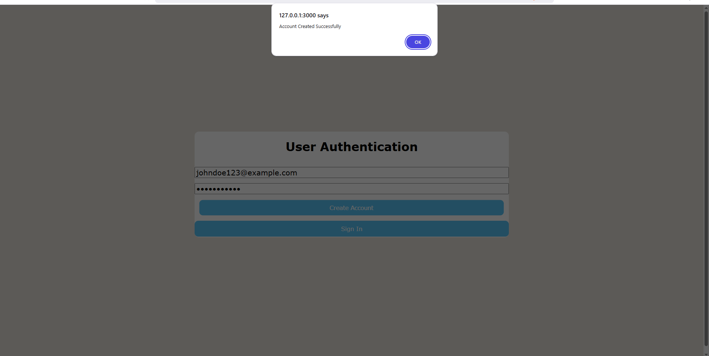
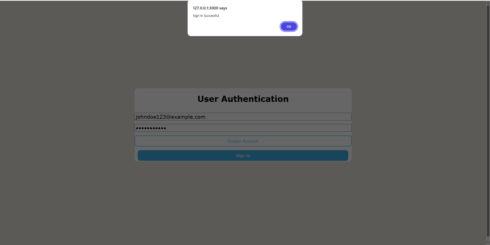
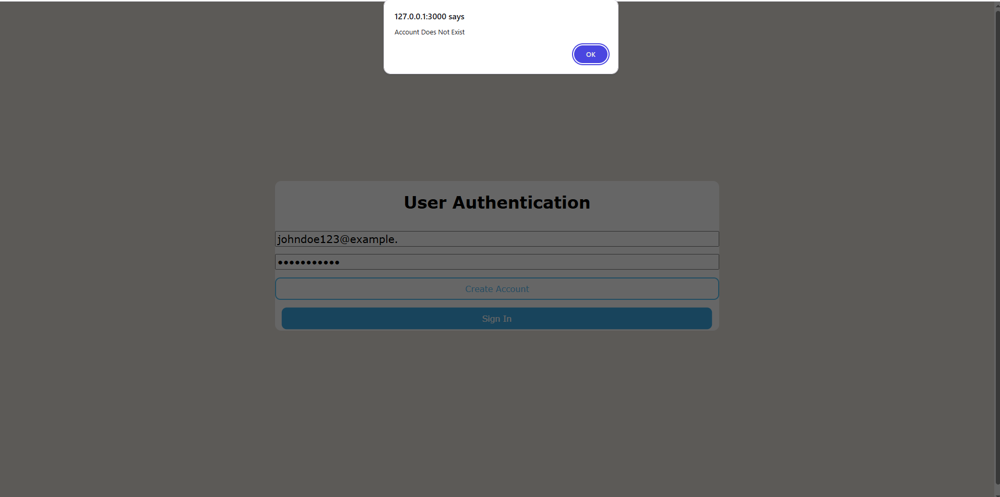
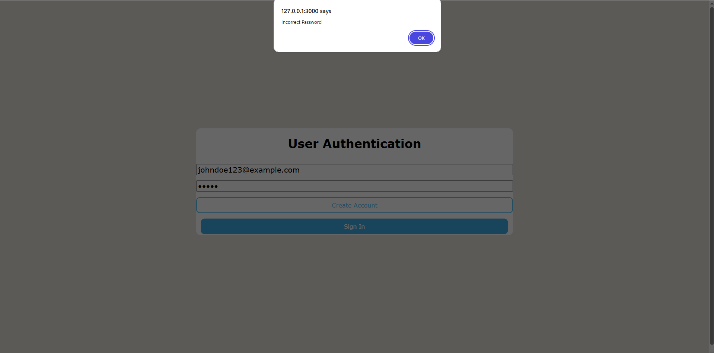
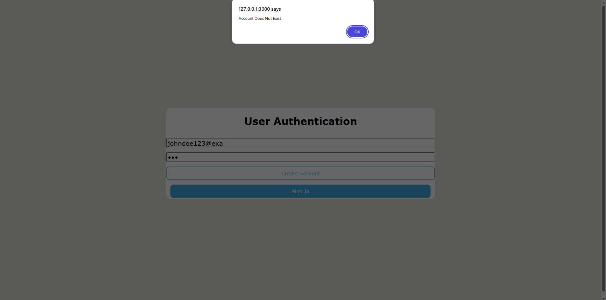
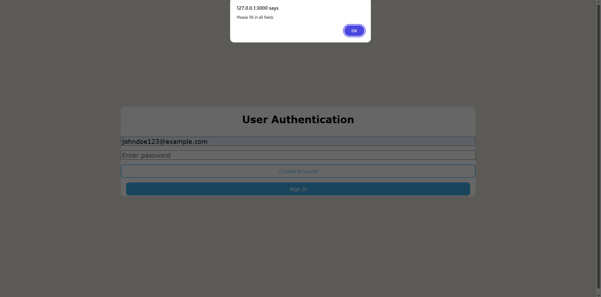
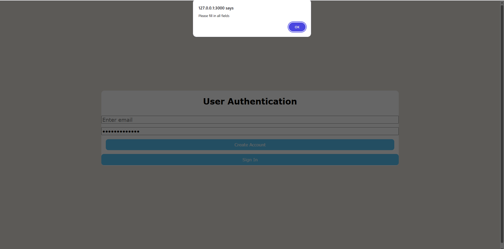

## Overview of the Project
- A straightforward demonstration of client-side user authentication (create account + sign in)
- Constructed with JavaScript, HTML, and CSS
- Puts more emphasis on comprehending the basics of the web than on production security

## HTML (Organisation)
- Used semantic input types: type="password" is a masked input, whereas type="email" includes browser-level validation.
- JavaScript can access elements through the DOM thanks to unique id properties.
- Buttons use onclick to initiate JavaScript logic
- Links external JavaScript and CSS files to separate concerns.

## CSS (Presentation)
- Uses Flexbox for responsive layout and centring
- Targeted HTML elements with id selectors like #email, #password, and buttons in addition to class selectors like .detailsPannel
- Uses typeface, responsive spacing for all devices, and a consistent web page layout
- Offers hover and active states for improved user experience
- Colour contrast and rounded corners for modernism and accessibility
- Demonstrates knowledge of responsive sizing and viewport units (vh).

## JavaScript (Functionality & Logic)
- Manages form validation and user interaction
- Uses .value to dynamically read input values
- Applies conditional reasoning to:
    - Avoid submitting nothing at all
    - Differentiate between creating an account and logging in.
- Uses localStorage to store and retrieve data
- Exhibits:
    - DOM manipulation
    - Parameter-based functions
    - Basic error management and alert-based user feedback

## Data Storage Choice (localStorage)
- Uses the built-in localStorage of the browser as a teaching tool.
- Enables concentration on:
  - JavaScript reasoning
  - Client-side state management
  - Key-value data storage concepts
- Avoids backend complexity during this learning phase.

## Security Acknowledgement / Limitations
- Not suitable for real-world authentication
- Passwords are stored:
    In plain text
    On the client-side
- Vulnerable to:
    XSS attacks
    Local device access
    Browser inspection tools
- No encryption, hashing, or server-side validation

## Why no backend was used
- The project focuses on front-end fundamentals: HTML structure, CSS styling, and JavaScript logic.
- Backend features (databases, hashing, authentication servers) were intentionally excluded to keep the scope educational and clear.
- In a production environment, secure backend handling would be required for user authentication and data protection.

## Future Improvements
- Replace localStorage with a secure backend
- Hash passwords (e.g. bcrypt)
- Add session handling / tokens
- Improve UI feedback without alerts
- Add form validation and error messaging

Shows Account Creation

Shows Successful Sign-in Following Account Creation

Shows Failed Sign-in Following Incorrect Email Input With Correct Password Input

Shows Failed Sign-in Following Correct Email Input With Incorrect Password Input

Shows Failed Sign-in Following Incorrect Email Input AND Incorrect Password Input

Shows Failed Sign-in When An Input Field Is Left Empty

Shows Failed Account Creation When An Input Field Is Left Empty
