## Overview of the Project
I built the Revision Scheduler as a client-side web application to help organise exams and plan revision sessions around them. I used HTML, CSS and JavaScript, with `localStorage` to save data between sessions.

The application allows users to create an account and sign in, add exams with a subject, date, time and colour, and view live countdowns until their exams. Revision sessions can then be created for the subjects already added, organised within a weekly timetable, and edited or deleted when needed.

I also implemented session ratings using 😀, 😐 and 😥. A poor rating automatically creates a replacement session for the following day at the same time. Throughout the project, I used JavaScript objects and arrays, JSON, DOM manipulation, `Date` objects, loops, conditional logic, input validation and CRUD functionality.

The project was mainly built to strengthen my understanding of how HTML, CSS and JavaScript work together to create an interactive web application, while keeping the scope entirely client-side without requiring a backend.

### CRUD Functionality
The revision session system demonstrates CRUD functionality:
- **Create** - `addSession()` creates a new session object and adds it to the `sessions` array.
- **Read** - `renderSessions()` reads the stored session objects and displays them in the timetable.
- **Update** - `editSession()` loads an existing session's data into the input fields, while `addSession()` replaces the original object when editing is complete.
- **Delete** - `deleteSession()` removes a selected session from the array using `splice()`.
After each change, the updated array is stored in `localStorage` using `JSON.stringify()`, allowing the changes to persist when the page is reloaded.

# Screenshots
## User Authentication
The app begins with a simple client-side authentication screen where users can create an account before signing in. User credentials are stored in the browser's localStorage as a JSON object, demonstrating JSON serialisation (JSON.stringify()), JSON parsing (JSON.parse()), and client-side state management without requiring a backend server.
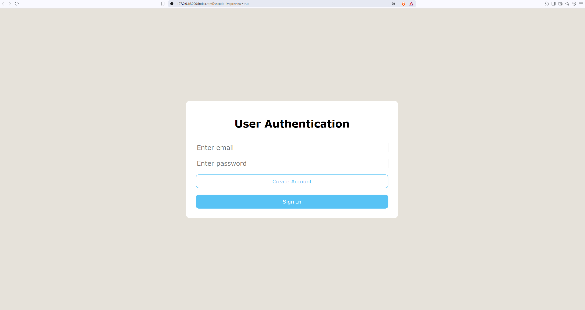

### Creating Account
The application validates that both input fields have been completed before creating a new account. If the email address is not already stored in localStorage, the account is created successfully.
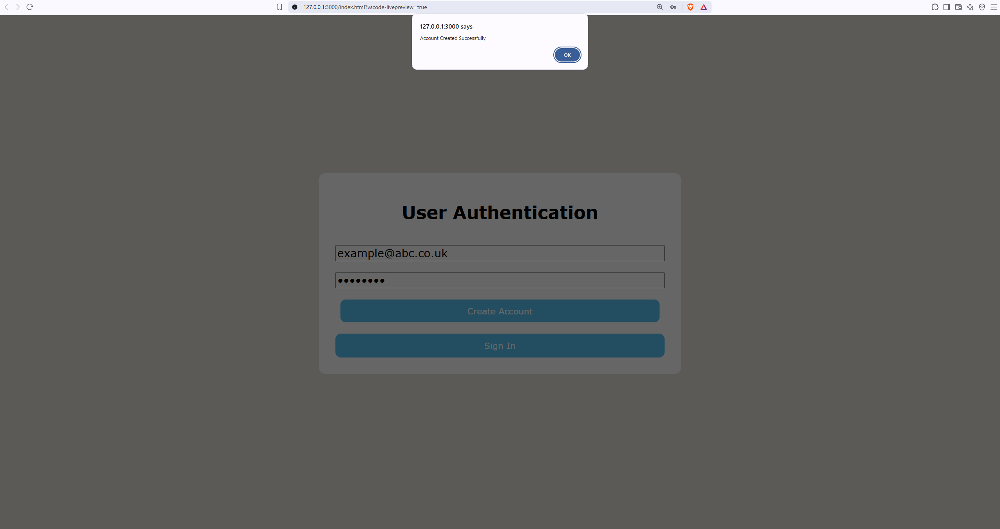

### Creating Account With Existing Email
Before creating a new account, the application checks whether the email already exists in localStorage. Duplicate accounts are prevented and appropriate feedback is displayed.
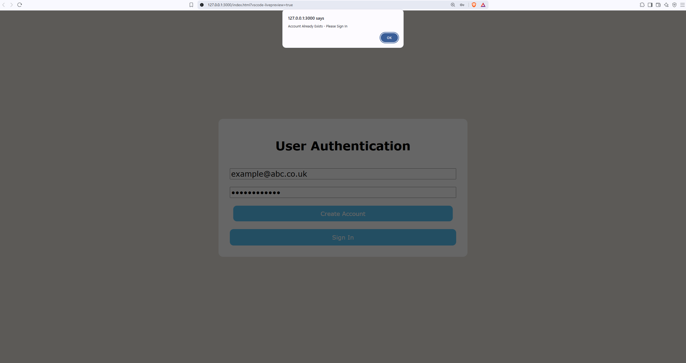

### Successful Login
When the entered credentials match the stored account, the user is authenticated and appropiate feedback is displayed.
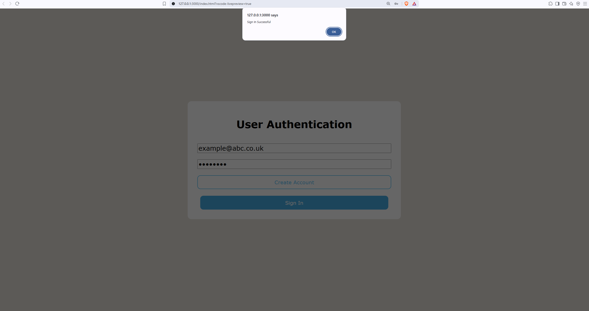

### Incorrect Password
If the email exists but the password does not match the stored value, the sign-in request is rejected and an error message is displayed.
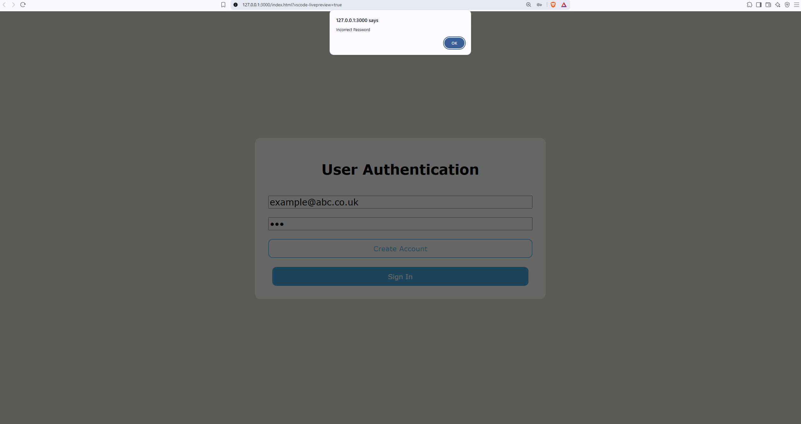

### Incorrect Email
If no account exists for the entered email address, the application detects this using localStorage.getItem() and informs the user that the account does not exist.
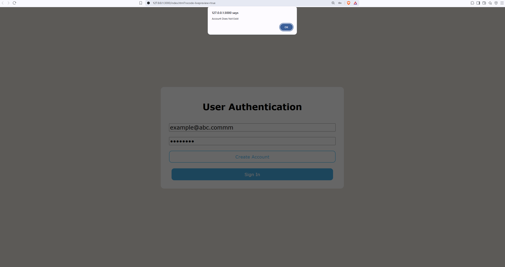

### Input Validation
The application validates user input before processing authentication requests. Empty fields are detected using conditional logic and boolean OR operations to prevent invalid account creation or sign-in attempts.
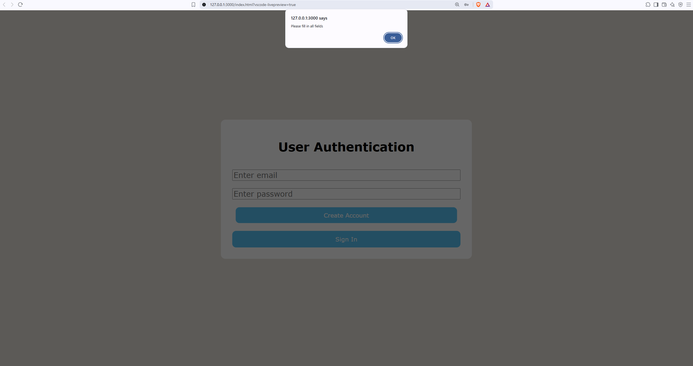

## Dashboard
After successful authentication, the application displays the revision dashboard, allowing users to manage exams, create revision sessions, and view their weekly timetable. The dashboard is dynamically updated using JavaScript DOM manipulation, and all data is persisted in the browser's localStorage.

## Adding an exam
Users must enter a subject name, exam date, exam time, and subject colour before adding the exam to the dashboard. Within script.js, the addExam() function validates the input, creates a JavaScript exam object, appends it to the exams array, serialises the array into JSON using JSON.stringify(), and stores it in localStorage. The interface is then immediately updated by calling displayExams(), which dynamically generates and renders a new exam card using DOM manipulation.

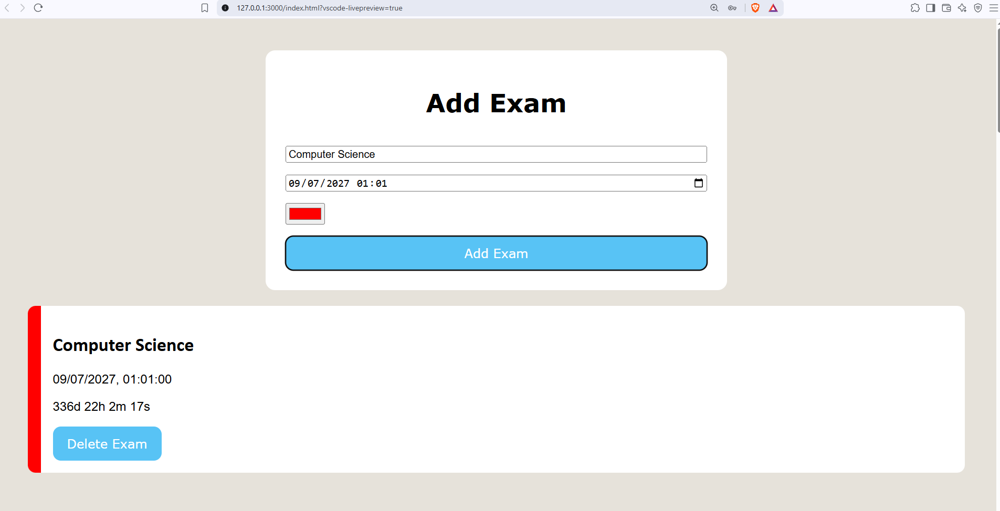
Multiple exams can be stored simultaneously, with each exam displayed as an individual card. The coloured border provides a visual identifier for the subject and is reused throughout the timetable to maintain a consistent colour scheme.

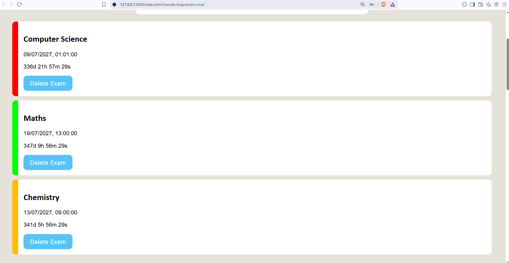
The live countdown calculates the remaining time until each exam using JavaScript Date objects and refreshes every second using setInterval(). The remaining days, hours, minutes, and seconds are dynamically written to the corresponding DOM element, providing a continuously updating countdown.

### Deleting an exam
Each exam card includes a delete button that removes the selected exam from the exams array. The updated data is written back to localStorage, the dashboard is re-rendered, and the subject selection list is refreshed to ensure the interface remains synchronised.
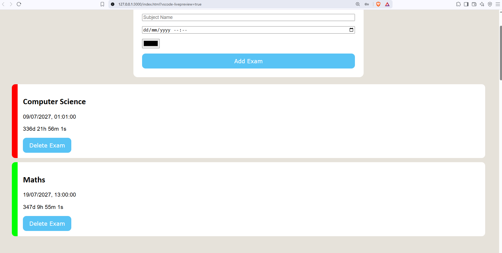

### Exam Validation
The addExam() function validates user input before creating an exam object. If one or more required fields are left empty (compared by boolean OR operator) the application prevents the exam from being added and displays an alert requesting that all fields are completed.
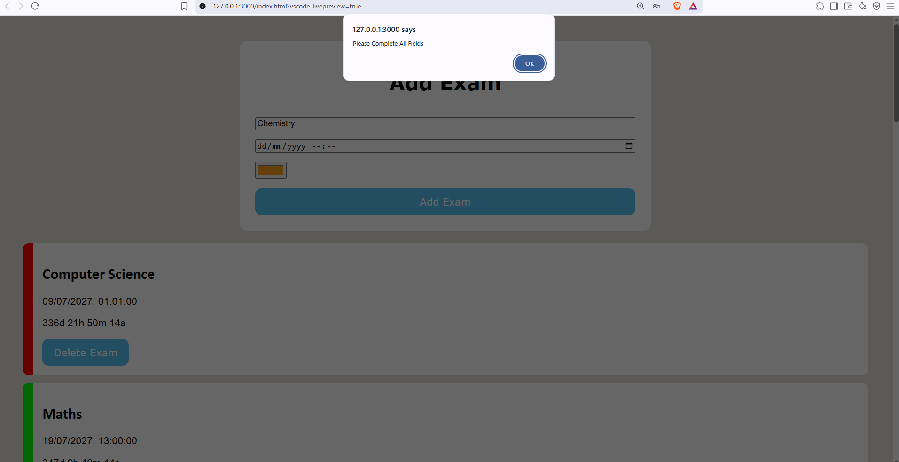

## Revision Sessions
The revision session system allows users to create, view, edit, delete and rate individual revision sessions directly within the weekly timetable for full CRUD functionality. Session data is stored as JavaScript objects inside the `sessions` array and persisted in `localStorage` as JSON.

### Adding a Revision Session
When adding a revision session, the subject dropdown is populated from the exams already stored in the `exams` array. This prevents users from scheduling revision for a subject that has not been added as an exam.

In `timetable.js`, `loadSubjectOptions()` loops through the existing exams, creates an `<option>` element for each subject, and appends it to the dropdown. `addSession()` then retrieves the selected subject, day and hours from the DOM before creating a new session object.

The timetable can be navigated using the Previous Week and Next Week controls. The current week is tracked using the `currentWeekDate` `Date` object, while `updateWeekLabel()` displays the currently selected date.

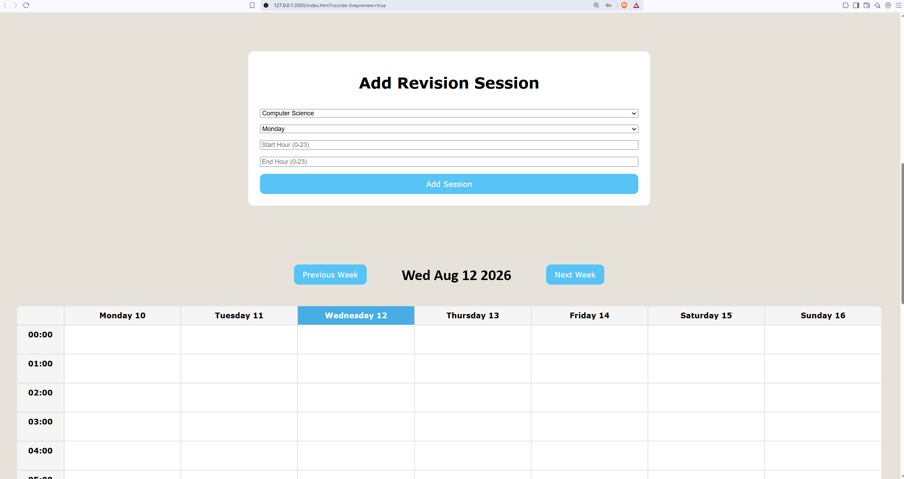
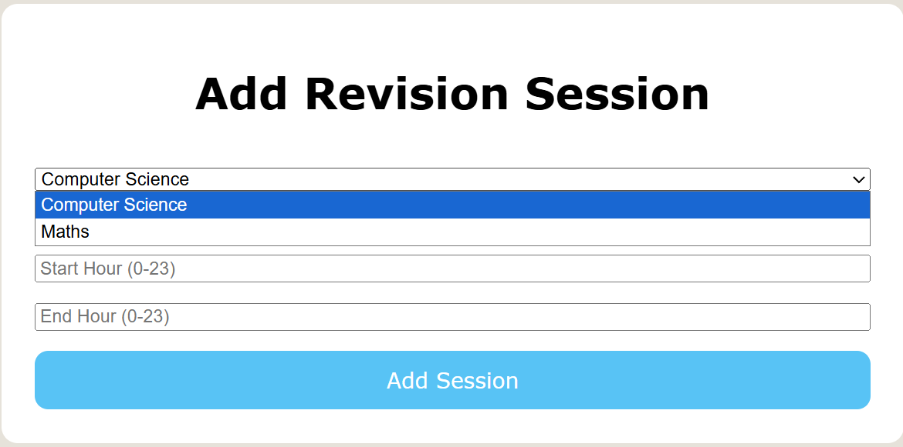
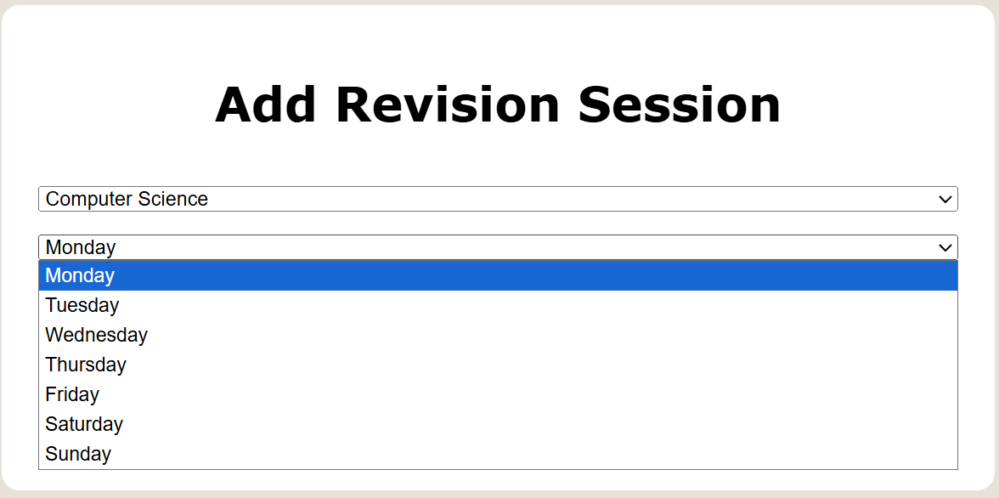

### Timetable View
The weekly timetable using real-time dates is generated automatically using JavaScript rather than being manually written into the HTML. In `timetable.js`, `generateTimetable()` creates the weekday headings and 24 hourly rows using loops and DOM manipulation. Each timetable slot is given `data-date` and `data-hour` attributes so that revision sessions can later be placed into the correct location.

When the week is changed, the timetable is rebuilt for the newly selected week and the saved sessions are rendered into their corresponding time slots.

Each session provides controls to mark it as completed by rating the effectiveness/productivity of the session, edit its details or delete it.

### Session Ratings
Once a revision session has been scheduled, the user can rate its effectiveness using three options: 😀, 😐 or 😥. Selecting a rating marks the session as completed and stores the rating within the session object.

The rating also determines whether a replacement session is required:
- 😀 - the session is completed and no replacement is created.
- 😐 - the session is completed and no replacement is created.
- 😥 - the session is completed and a replacement session is automatically created for the following day at the same time.

In `timetable.js`, `rateSession()` updates the session's `completed` and `rating` properties before saving the updated `sessions` array to `localStorage`. The poor-rating condition then calls `rescheduleSession()` from `reschedule.js`, separating the rescheduling logic from the rating logic.

### Editing Sessions
Each unscheduled session has an Edit button alongside its rating and delete controls.

Selecting Edit retrieves the corresponding session object and places its existing subject, day and start/end hours back into the revision session form. The session's array index is stored in `editingSessionIndex` so that the program knows which existing object is being modified.

When the form is submitted, `addSession()` checks whether `editingSessionIndex` contains an index. If it does, the existing session object is replaced with the updated version rather than creating a duplicate session.

This demonstrates the Update component of CRUD functionality.

This example shows changing the computer science session into a maths session.
1. Clicking Edit calls editSession(), which retrieves the selected session object and stores its array index in editingSessionIndex

2. The page automatically returns to the revision form using scrollIntoView(), with the existing session details populated for editing

3. After submission, addSession() updates the existing session object rather than creating a duplicate, then saves the updated sessions array to localStorage as JSON 

### Deleting Sessions
Each unfinished revision session also has a Delete button. When selected, `deleteSession()` removes the corresponding session from the `sessions` array using JavaScript's `splice()` method.

The modified array is then saved back to `localStorage`, and `renderSessions()` rebuilds the timetable so that the deleted session is immediately removed from the interface.

This demonstrates the Delete component of CRUD functionality and shows how changes to the application state are reflected in the UI.

This example shows deleting a two-hour Thursday session and removing all timetable blocks associated with it.

### Input Validation
`addSession()` performs several validation checks before allowing a revision session to be added or updated. These checks prevent logically invalid sessions from entering the `sessions` array.

Validation is performed before the session object is created and saved to `localStorage`.

#### Scheduling a Passed Date
A session cannot be scheduled for a date that has already passed. `addSession()` creates a `Date` object for the selected weekday and compares it with today's date.

Both dates have their time components removed before comparison so that the validation checks the dates rather than the current time of day. If the selected date is earlier than today, the function stops and displays a specific "Cannot Schedule A Session Before Today" message.

#### Scheduling an Invalid Session
The program also checks that the session has a valid duration. If the start hour is equal to or later than the end hour, the session is rejected because it would have no positive duration.

The user receives a specific "End Hour Must Be Greater Than Start Hour" message.
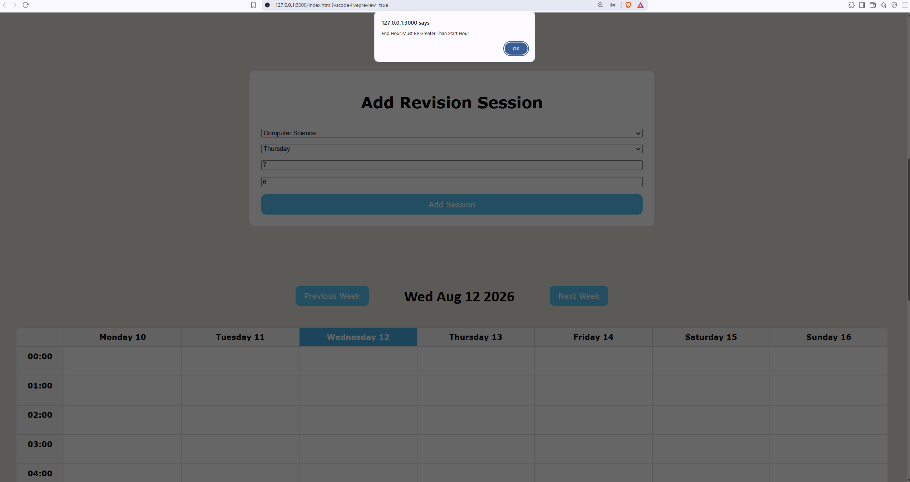

#### Scheduling a Session Outside Valid Hours
The program validates that the selected start and end hours fall within the permitted range of the timetable.

The validation handles three cases:
- Both the start and end hours are outside the permitted range.
- Only the start hour is outside the permitted range.
- Only the end hour is outside the permitted range.

In each case, an appropriate error message is displayed and the function returns before the session can be saved.
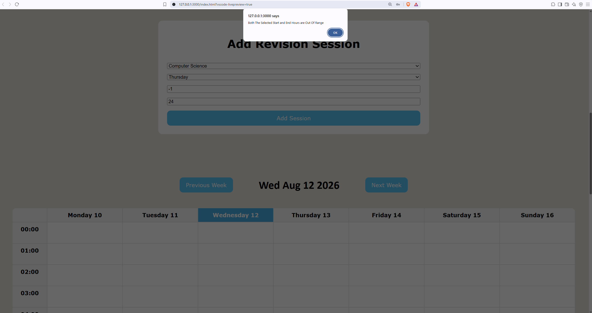
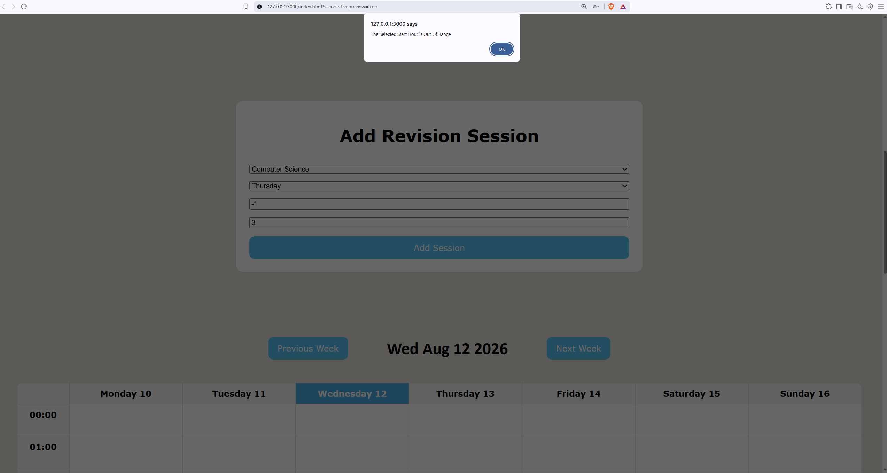
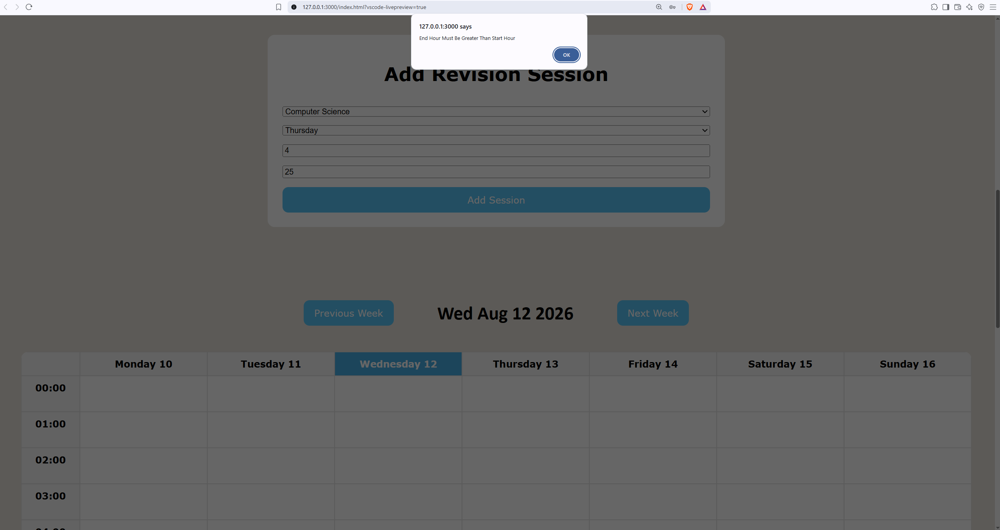

#### Scheduling an Overlapping Session
The program prevents two revision sessions from occupying the same time period on the same date.

Before creating the session, `addSession()` loops through the existing `sessions` array. Sessions are first compared by date, and the program then checks whether their start and end times overlap.

The overlap condition is:
startHour < existing.endHour && endHour > existing.startHour
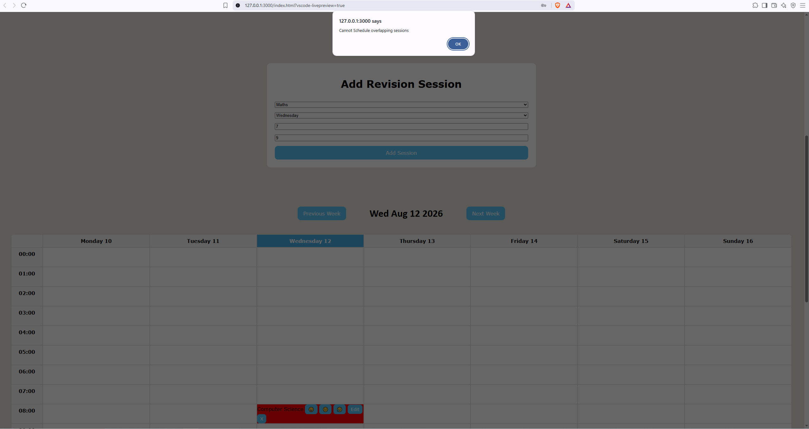

#### Scheduling After the Exam
Revision sessions cannot be scheduled after the corresponding exam date. `addSession()` retrieves the selected exam's date and compares it with the proposed session date. If the session would occur after the exam, it is rejected with a "Cannot schedule a revision session after the exam date" message.
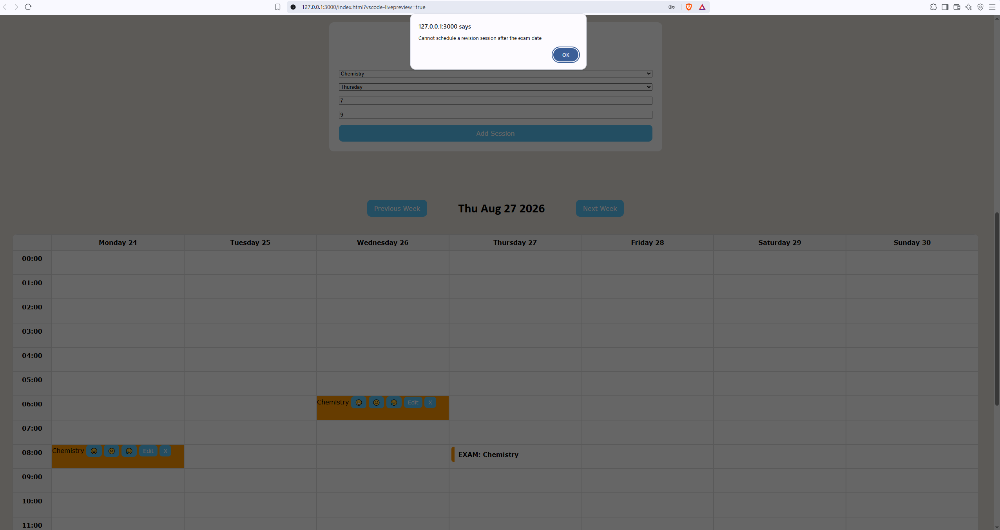

