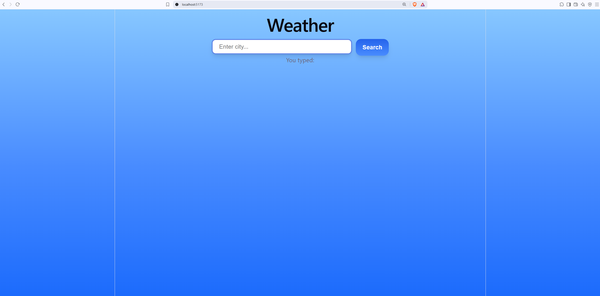
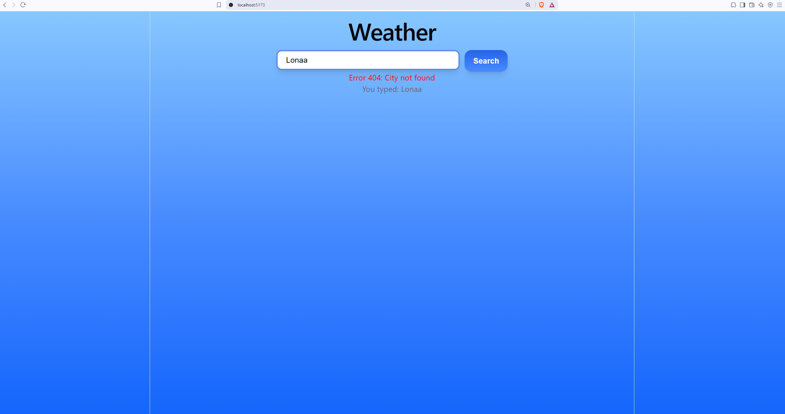
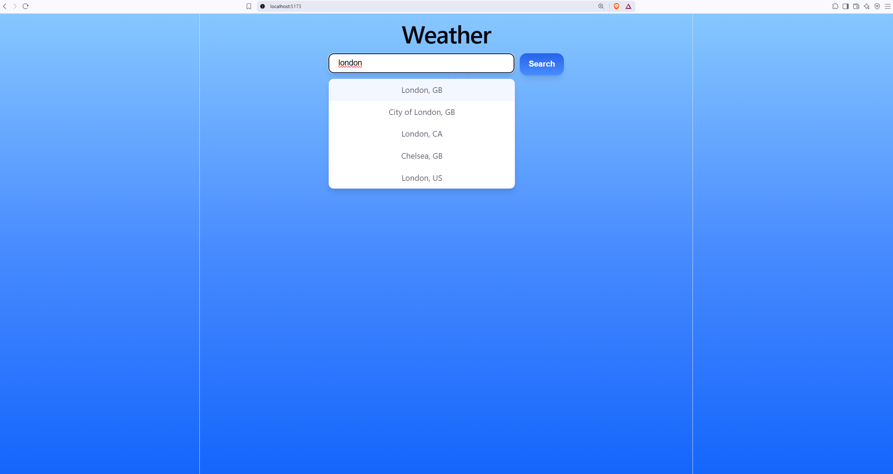
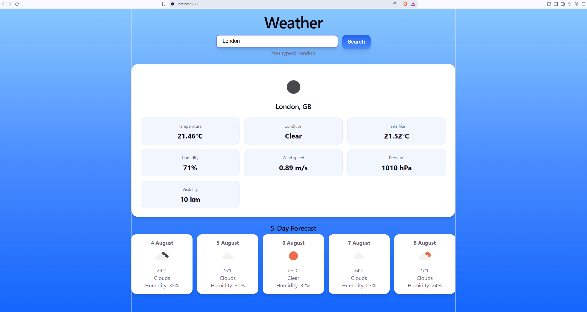
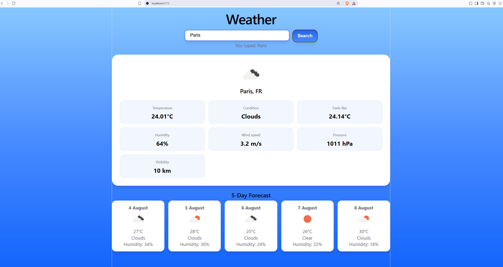

# React.js Weather App
This project was developed to n my React.js skills and to learn how to integrate 3rd party APIs.
## Features
- Search for weather in cities worldwide
- Live city autocomplete using the OpenWeather Geocoding API
- Current weather dashboard
- 5-day weather forecast
- Dynamic weather icons
- Error handling for invalid locations

## Technologies
React.js, JavaScript, JSX, CSS, OpenWeather API

## Search Screen
### Initial Search Screen
Upon launching the web application, users are presented with a blue gradient background, popular amongst modern weather apps, alongside an intuitive search bar for finding weather information in cities worldwide.

### Validaiton Check: Invalid Search
Invalid searches return a 404 error, meaning the OpenWeather API could not find a matching location thus clearing any previously displayed weather information.

### Auto-Complete for Valid Search
Once the user types more than 1 character, the OpenWeather Geocoding API returns a list of matching cities, allowing users to quickly select their intended location.
React's useState() hook was used with the onChange event to control the search input and update the state variable every time the user types. This allows the application to dynamically fetch autocomplete suggestions and perform searches without manually accessing the HTML input element.

## Weather Dashboard
### Current Weather Dashboard
After selecting a location, React asynchronously requests both the current weather and the 5-day forecast from the OpenWeather API using JavaScript's fetch() function with async and await. The returned JSON responses are then parsed and stored in React state variables using the useState() hook, causing the UI to automatically render the reusable dashboard cards with the latest weather information.

The current forecast is displayed on a prominent UI card with other useful weather metrics such as humidity, condition, feels like. 
The 5-day forecast abstracts less important weather information to reduce clutter on their less prominent, smaller sized cards.

Weather icons are generated dynamically using the weather condition codes returned by the API, allowing the correct icon to be displayed without manually mapping each weather type. The five forecast cards are rendered dynamically using React's .map() method, creating a reusable card component for each day's forecast instead of duplicating HTML and React's .filter() method is used to extract only the 12:00 PM forecast from the 3-hourly data returned by the API.

### Searching a Different City
After entering a new city, the forecast for the current day and 5-days in the future of the current city is wiped and updated to the new city's forecast.

### Invalid Search After a Successful Search
If the user then enters an invalid city, the forecast for the current day and 5-days in the future is destroyed to appropiately return a 404 error without displaying any weather information.

## React and JavaSctipt Concepts Used
- State management using React's `useState()` hook
- Event handling using `onChange`, `onClick`, and `onKeyDown`
- Conditional rendering to display UI only when valid data exists
- Dynamic component generation using `.map()` to render forecast cards
- Data filtering using `.filter()` to select the 12:00 forecast each day
- Asynchronous programming using JavaScript's `fetch()` API and `async/await`
- JSON parsing and integration with third-party REST APIs

## API Integration
The application integrates the OpenWeather Current Weather, 5-Day Forecast, and Geocoding APIs. User searches trigger asynchronous HTTP requests using JavaScript's `fetch()` function. The JSON responses are parsed and stored in React state variables before being rendered dynamically within the user interface.
